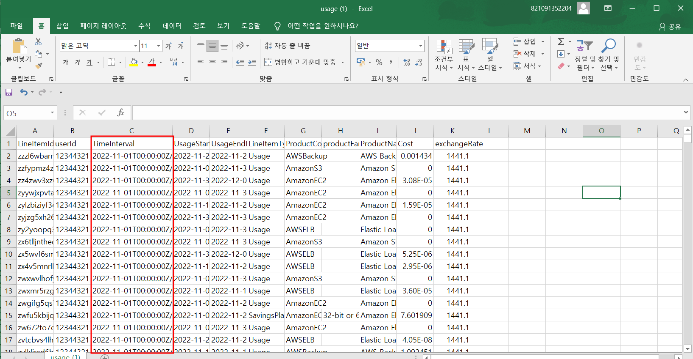
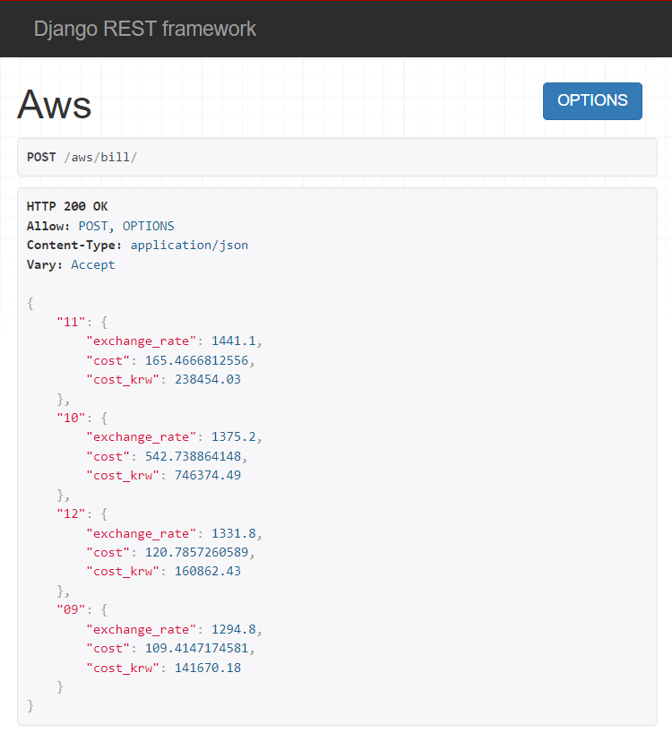

# Emhaki-wishket_project

# 목차

[1. 과제 접근 방식](#1과제-접근-방식)   

[2. 코드 리뷰](#2코드-리뷰)  

[3. 과제 소감](#3과제-소감)

## 1.과제 접근 방식

### [시도 1] AWS lambda + AWS gateway
<br>

- 압축 파일 내의 데이터는 데이터베이스에 별도로 저장하지 않고, API 요청시마다 url에 새로 호출하라는 조건을 보고 Serverless로 구현해야겠다는 생각이 들었습니다. 
- AWS lambda와 AWS gateway를 사용하면 URL호출시 마다 함수를 동작시켜 서버에서 데이터를 읽고 조건을 필터링해 csv파일로 변환하는데 까지는 성공했습니다. (2022/11 입력시)

- 하지만 명세에 맞는 예외처리 조건을 충족하기 어려웠고 사용 요금 조희 API에서는 form-data를 받아야 하기 때문에 단순 함수로는 안되겠다는 생각이 들었습니다.
- Class Based View 사용을 권장한다는 검토 기준을 보면서 다른 방식으로 접근해야겠다는 생각이 들었습니다.

### [시도 2] DRF 코드 작성
<br>

- DRF로 프로젝트를 진행해본 경험은 없지만 CBV 방식과 객체를 효율적으로 사용하기 위해서는 DRF 코드로 작성해야겠다는 생각이 들었습니다.
- 최대한 Class Based View 방식으로 코드를 작성하려고 노력했습니다. 
- 데이터를 데이터베이스에 따로 저장하지 않고 함수 내에서 파일을 읽어 필터링하고 바로 값을 반환하도록 코드를 작성했습니다.


## 2.코드 리뷰

### **사용 내역 조희 API**

### urls.py

```py
from django.urls import path
from .views import AWSViewSet

urlpatterns = [
    path('aws/usage/<int:year>/<int:month>/', AWSViewSet.as_view({'get': 'usage'}), name='usage'),
]
```
> ⬆️ 파라미터로 year, month값을 받기 위해 urls.py에 경로를 추가했습니다. url에 접속시 AWSViewSet 클래스에서 usage함수를 불러오도록 코드를 작성했습니다.

### views.py

```py
class AWSViewSet(viewsets.ViewSet):
    
    @action(detail=False, methods=['get'])
    def usage(self, request, year, month):

        # 예외 처리 조건 2
        # 입력해야 할 year, month 값이 없는 경우 
        if not year or not month:

            return Response({'error': "입력해야 할 year, month 값이 없습니다."}, status=status.HTTP_404_NOT_FOUND)
```
> ⬆️ ViewSet을 상속받도록 코드를 작성했으며 usage함수에 get요청이 오면 parameter로 넘어온 year, month값에 따라 코드가 실행되게 됩니다. year과 month값이 없다면 에러 코드를 반환하도록 합니다.
```py
        # 데이터가 저장된 zip파일 저장
        url = 'http://dtgqz5l2d6wuw.cloudfront.net/coding_test_1.csv.zip'

        # 예외 처리 조건 1
        # 데이터 URL에 파일이 없는 경우
        if not urllib.request.urlopen(url):
            return Response({'error': '데이터 URL에 파일이 없습니다.'}, status=status.HTTP_404_NOT_FOUND)

        with urllib.request.urlopen(url) as data:
            # 예외 처리 조건 3
            # 데이터 URL의 압축 파일이 10MB를 넘는 경우
            if data.getheader('Content-Length') and int(data.getheader('Content-Length')) > 10*1024*1024:

                return Response({'error': '데이터 URL의 압축 파일이 10MB를 넘습니다.'}, status=status.HTTP_500_INTERNAL_SERVER_ERROR)
```
> ⬆️ 데이터가 저장된 url을 읽도록 해줍니다. 만약 데이터 url에 파일이 없는경우 에러를 반환하도록 하고 url의 압축 파일이 10MB가 넘는 경우 또한 에러를 반환하도록 합니다.
```py
            # zip파일을 csv로 변환
            with zipfile.ZipFile(io.BytesIO(data.read())) as zip_file:
                csv_filename = zip_file.namelist()[0]
                with zip_file.open(csv_filename) as csv_file:
                    csv_reader = csv.reader(io.TextIOWrapper(csv_file, encoding='utf-8'))
                    rows = []
                    for row in csv_reader:
                        rows.append(row)
        
        # 주어진 데이터 엑셀의 TimeInterval 값에서 해당 year-month로 시작하는 데이터 필터링
        filtered_rows = []
        for row in rows:
            if row[2].startswith(f'{year}-{month}'):
                filtered_rows.append(row)
```
> ⬆️ zip 파일을 csv파일로 변환하고 csv파일의 세번째 열에 해당하는 TimeInterval 값에서 파라미터로 넘어온 year, month에 해당하는 데이터를 filtered_rows에 저장합니다.
```py
        # csv파일 생성
        csv_buffer = io.StringIO()
        writer = csv.writer(csv_buffer)
        writer.writerow(['LineItemId','userId','TimeInterval','UsageStartDate',	'UsageEndDate', 'LineItemType',	'ProductCode', 'productFamily', 'ProductName', 'Cost', 'exchangeRate'])
        writer.writerows(filtered_rows)
        csv_content = csv_buffer.getvalue()

        result = {
                'ContentType': 'text/csv',
                'Filename': f'attachment; filename=usage.csv',
                'body': csv_content
        }
        return Response(result, status=status.HTTP_200_OK)
```
> ⬆️ csv파일을 생성하고 각 열에 이름을 기록해줍니다. 그리고 필터링된 데이터를 작성시켜주고 작성한 데이터를 Response해줍니다.

<br>

### **사용 요금 조희 API**

### urls.py

```py
from django.urls import path
from .views import AWSViewSet

urlpatterns = [
    path('aws/bill/', AWSViewSet.as_view({'post': 'bill'}), name="bill")
]
```
> ⬆️ aws/bill 로 접속시 AWSViewSet에 bill함수가 실행되도록 url을 설정했습니다.

<br>

### views.py

```py
class AWSViewSet(viewsets.ViewSet):
@action(detail=False, methods=['post'])
    def bill(self, request):
        # POST 요청에서 form-data 파라미터 가져오기
        user_id = request.data.get('user_id')
        year = request.data.get('year')
        month = request.data.get('month')
```
> ⬆️ form-data로 받은 값을 각각 user_id, year, month에 저장합니다.
```py
        # 데이터 압축 파일 URL
        data_url = "http://dtgqz5l2d6wuw.cloudfront.net/coding_test_1.csv.zip"
        # 압축 파일 다운로드
        r = requests.get(data_url)
        # 압축 파일을 메모리에서 읽어들이기
        z = zipfile.ZipFile(io.BytesIO(r.content))
        # csv 파일 읽기
        with z.open('coding_test_1.csv') as f:
            reader = csv.DictReader(io.TextIOWrapper(f))
            # 필터링된 row들을 저장할 리스트
            filtered_rows = []
            for row in reader:
                # TimeInterval에서 year, month 추출 => str타입
                year_interval = row['TimeInterval'].split('-')[0]
                month_interval = row['TimeInterval'].split('-')[1]
```
> ⬆️ data_url에 압축 파일을 다운로드하고 csv파일을 읽도록 합니다. csv파일을 읽으면서 TimeInterval의 년도와 월을 각각 year_interval, month_interval에 저장시킵니다.
```py
                # 오류 처리 조건
                # 데이터 URL의 파일에 환율 정보가 없는 경우
                if not row['exchangeRate']:
                    return Response({'error': "데이터 URL 파일에 환율 정보가 없습니다."}, status=status.HTTP_400_BAD_REQUEST)
```
> ⬆️ 만약 exchangeRate가 없다면 에러를 반환합니다.
```py
                # 필터링 조건 확인
                # month 값이 있다면 해당 월 데이터 필터링
                if int(month_interval) == month and int(row['userId']) == user_id and int(year_interval) == year:
                    filtered_rows.append(row)
                # month 값이 없다면 해당 년 데이터 필터링
                elif not month and int(row['userId']) == user_id and int(year_interval) == year:
                    filtered_rows.append(row)
            # print(filtered_rows)
```
> ⬆️ form-data로 넘어온 값과 csv파일에 있는 년도와 일치하는 값을 filtered_rows에 저장합니다. 만약 month값이 없다면 해당 년도에 데이터를 filtered_rows에 저장합니다.
```py
            # 월별로 분리하여 계산하기
            result = {}
            month_costs = {}
            month_exchange_rates = {}

            for row_data in filtered_rows:
                mth = row_data['TimeInterval'].split('-')[1]
                # exchange_rate 계산
                exchange_rate = Decimal((row_data['exchangeRate']))
                if mth not in month_exchange_rates:
                    month_exchange_rates[mth] = []
                month_exchange_rates[mth].append(exchange_rate)

                # cost 계산
                cost = Decimal((row_data['Cost']))
                if mth not in month_costs:
                    month_costs[mth] = Decimal(0)
                month_costs[mth] += cost
```
> ⬆️ 월별로 분리하기 위해 딕셔너리를 만들어줍니다. 필터링한 데이터 filtered_rows를 for문으로 순회하면서 mth에 month값( row_data['TimeInterval'].split('-')[1] )을 저장시켜줍니다. 각 딕셔너리에 해당 mth가 없다면 key값을 생성해주고 있다면 value에 추가해줍니다.
```py
                # 각 월별로 환율, 요금, 원화요금 계산         
                # 월별 환율 계산 (소수점 8자리까지 계산)
                exchange_rate_avg = sum(month_exchange_rates[mth]) / len(month_exchange_rates[mth])
                exchange_rate_avg = round(exchange_rate_avg, 8)

                # 월별 요금 계산
                mth_cost = month_costs[mth]

                # 월별 원화 요금 계산 (소수점 2의 자리에서 버림)
                cost_krw = round((mth_cost * exchange_rate_avg), 2)
                
                # 결과값 저장
                if mth not in result:
                    result[mth] = []
                    
                result[mth] = {
                    "exchange_rate": exchange_rate_avg,
                    "cost": mth_cost,
                    "cost_krw": cost_krw
                }
              
            # 결과값 반환
            return Response(result)
```
> ⬆️ 조건에 맞게 계산한 값을 exchange_rate_avg, mth_cost, cost_krw에 저장해줍니다. result 딕셔너리 또한 mth값이 없다면 키를 생성해주고 있다면 value를 추가해줍니다. 필터링한 데이터를 다 순회했다면 Response(result)를 해줍니다.

<br>

## 3.과제 소감

- serverless 접근 방식으로 인해 AWS lambda, AWS gateway, Zappa를 공부하면서 꽤 많은 시간이 걸렸습니다. 

- window환경에셔 zappa로 lambda에 deploy하기 까다로웠고 많은 시행착오를 겪었습니다. 이러한 시행착오 덕분에 서버리스 아키텍처를 이해하고, IAM, AWS Lambda, AWS Gateway의 작동 방식 및 로직에 대해 알게 되었습니다.

- 그 후에는 DRF Class Based View를 사용해야겠다는 생각이 들면서 DRF를 공부했습니다. ViewSet으로 클래스를 상속 받으면 코드가 훨씬 간결해진다는 점과 urls.py에서 router방식으로 코드를 작성하면 코드의 반복을 줄일 수 있고 RESTful한 API를 개발할 수 있음을 알게 됐습니다. 

- 코드를 작성하면서 API명세에 맞게 코드를 잘 작성했는지에 대한 의문이 들지만 결과물과 상관없이 주니어 개발자인 저에게 과제를 할 수 있는 기회를 주심에 감사드립니다.

- 이 과제를 통해 더욱 더 발전하고 싶다는 열정과 의지가 생겼습니다. 다시 한 번 감사드립니다.
